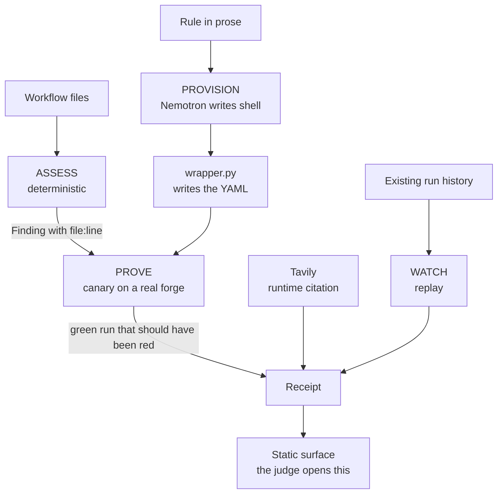
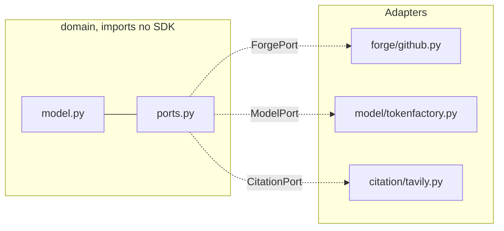

# ἔλεγχος / Elenchos

[](https://github.com/upgradedev/elenchos/actions/workflows/ci.yml)
[](LICENSE)

**Your pipeline's green check is a claim, not a control. Elenchos pushes a build that breaks the
rule and returns the green run as proof.**

Demo, no account and no install: https://upgradedev.github.io/elenchos/

*ἔλεγχος* is the Socratic method of refutation, and in modern Greek it is the ordinary word for an
audit. The product is the intersection. Elenchos does not conclude that a CI gate is theatre. It
proves it, by breaking the gate and handing back a link to a real green run that should have gone
red.

## Contents

- [Who this is for](#who-this-is-for)
- [Where the code goes](#where-the-code-goes)
- [What it does](#what-it-does)
- [Where the sponsor's model is load-bearing](#where-the-sponsors-model-is-load-bearing)
- [The numbers, and the commands that produced them](#the-numbers-and-the-commands-that-produced-them)
- [Architecture](#architecture)
- [Quickstart](#quickstart)
- [What is live and what is declared](#what-is-live-and-what-is-declared)
- [Prior art, and what is not ours](#prior-art-and-what-is-not-ours)
- [Safety](#safety)
- [Licence](#licence)

## Who this is for

Maximos is an engineering director at a regulated company. Two hundred repositories, fifty
engineers across frontend, backend, QA, cloud and mobile, plus contractor teams, split across
GitHub and Azure DevOps. Once a year he signs a statement that the security checks are in place.
At the last audit he was asked to prove it for one repository, and all he had was a green tick.

A green tick is not evidence. It is the output of a control nobody has tested.

## Where the code goes

Maximos cannot paste his pipeline definitions into a US hosted coding agent. That is not a
preference, it is the reason most tools in this category never get past his security review.

Elenchos reads pipelines with an open weight NVIDIA model served from Nebius in European regions.
Because the weights are open, the same model can be run inside a customer's own boundary, and the
design keeps it behind a single port, so moving it there changes one adapter and nothing else.

Stated plainly, because the honest version is the one that survives a question: **our own demo
calls the hosted Token Factory API. It is not air gapped and we do not describe it that way.**
What is true today is that the pipeline is read by an open weight model running in Europe rather
than by a closed model in another jurisdiction, and that moving to self hosted weights is an
adapter change rather than a rewrite.

## What it does

Four stages. A model is load-bearing in exactly one of them.

| Stage | What happens | Who does it |
|---|---|---|
| **ASSESS** | read the pipeline, say what each step actually enforces, with `file:line` | deterministic |
| **PROVISION** | read a rule written in prose, produce the check that enforces it | Nemotron, and only here |
| **PROVE** | break that rule on a real forge and keep the green run as a receipt | deterministic |
| **WATCH** | replay existing history to see whether anyone turned the control off | deterministic |

PROVE is the hero, not PROVISION. Watching a model write YAML is a commodity in 2026. Watching a
pipeline go green on a commit that breaks the rule it claims to enforce is not.

## Where the sponsor's model is load-bearing

Remove Nemotron and the product stops doing the thing it is for. A rule a human wrote in a
sentence stays a sentence. Nothing turns "every workflow declares permissions" into a check that
runs, so there is no control to test, and with no control there is nothing to refute. The
deterministic stages have no input.

That is the one job it does, and the split is measured rather than asserted. On twenty rules
registered in advance it scored 16, 14 and 14 against a threshold of 14 written down first, while
a fixed template scored 2.

The model returns a **shell script and never YAML**. Deterministic code writes the workflow around
it, in [`src/elenchos/provision/wrapper.py`](src/elenchos/provision/wrapper.py). That division was
not a design preference, it was a finding: see the numbers below.

## The numbers, and the commands that produced them

Every figure carries the command that produces it. Scores we produced ourselves are estimates and
say so, permanently.

**Can the model actually write the check?** Twenty rules, written down before any model was
called, each scored by executing the produced check twice: once against a repository that violates
the rule, where it must exit non-zero, and once against a clean one, where it must exit zero.
Either half alone scores nothing.

```bash
cd killtest && python harness.py --producer nemotron_b
```

| Producer | Score | What it is |
|---|---|---|
| Hand written oracle | 20/20 | calibration. Nothing else was allowed to count until this passed |
| **Nemotron, shell only** | **16, 14, 14** | three runs, threshold of 14 written down first |
| Nemotron, writing YAML too | 10, 13, 14 | the same model asked to do both jobs |
| Fixed template | 2/20 | a skeleton that matches words, the baseline to beat by six |

The endpoint is not deterministic at `temperature 0`, which is why three runs are reported rather
than one. The protocol fixing the number of runs was written before the third was fetched, in
[`killtest/REPLICATION.md`](killtest/REPLICATION.md).

**Does the refutation actually work?** One real run on this repository, produced by
`scripts/prove_canary.py` rather than by hand:

```bash
GITHUB_TOKEN=... python scripts/prove_canary.py --repo upgradedev/elenchos --base chore/kill-test
```

[Run 33625228654](https://github.com/upgradedev/elenchos/actions/runs/33625228654) reports
**success** on commit `9762a80`, which carries a file the pipeline's own scan detects. The log says
`planted finding detected, this build must not pass` and the step exits 1.

There are two lies in that run, and the second is the sharper one. The job is green. **And the
forge reports the scan step itself as `success`**, because `continue-on-error` rewrites the step's
conclusion, so the API agrees with the badge. Only the log disagrees. A dashboard built on step
conclusions would show that pipeline as healthy.

The target it refutes is [`canary-target.yml`](.github/workflows/canary-target.yml), which is
broken on purpose and is the only neutered control in this repository. `scripts/gates.py` knows it
by path and fails the build if a second one appears.

**Is the problem real?** One hundred and twenty public repositories, none of them ours, each
finding carrying `owner/repo` and `file:line`, with the threshold registered before the count.

- **21 of the 47** repositories that run their own security or quality script have it narrower
  than the step's name claims
- **18 of 120** carry a step neutered by `continue-on-error`, `|| true` or a trailing `exit 0`

Published baseline, cited rather than re-measured: Basak et al. 2023, SecretBench, arXiv 2307.00714,
818 repositories and 97,479 labelled secrets, reporting 6% recall for GitHub's secret scanner.

## Architecture



The boundary that keeps the model honest:



`scripts/gates.py` fails the build if anything under `src/elenchos/domain/` imports an SDK.

## Quickstart

Python 3.11 and git. No account and no key are needed for anything below.

```bash
git clone https://github.com/upgradedev/elenchos.git
cd elenchos
python -m pip install -r requirements/ci.txt
```

Point it at any public repository. No token, no account, nothing is written:

```bash
python -m elenchos assess FaserF/hassio-addons
```

That is a repository we have nothing to do with, and it prints this:

```
FaserF/hassio-addons: 29 workflow files, 295 named steps

  .github/workflows/orchestrator-ci.yaml:388
    claims    Platinum Compliance Check
    actually  continue-on-error: true, so the step reports failure and the job stays green

  .github/workflows/orchestrator-intake.yaml:64
    claims    Compliance Check & Comment
    actually  || true, so the command's failure is discarded by the shell
```

A step named "Platinum Compliance Check" that cannot fail. Open
[the file at line 388](https://github.com/FaserF/hassio-addons/blob/main/.github/workflows/orchestrator-ci.yaml#L388)
and check it against the output before believing either of us.

`assess` never writes. It is constructed with an empty allowlist, so every write path refuses
before a socket opens, and a test asserts that rather than trusting the sentence. Pushing a canary
to prove a finding needs a repository you own and lives behind a separate command.

When a repository comes back with nothing, the output says that a clean read is not a clean bill of
health, because this reads workflow files one hop and line by line.

Run the repository's own gates, including the proof that each gate can fail:

```bash
python scripts/gates.py --selftest && python scripts/gates.py
```

Expected: every line reads `ok`, and the selftest reports `fails as designed` four times. Under
five seconds.

Re-score the kill test from the recorded model responses, offline:

```bash
cd killtest && python harness.py --producer oracle && python harness.py --producer template
```

Expected: `oracle: 20/20` then `template: 2/20`. About twenty seconds. Re-generating the model's
answers instead of re-scoring them needs a Nebius key and
`python producers/nemotron_fetch.py --mode body`.

## What is live and what is declared

| Capability | State |
|---|---|
| ASSESS over GitHub workflow files | live, with tests |
| PROVISION through Nemotron on Token Factory | live, measured at 16/14/14 |
| The wrapper that turns a script into a step | live, and the kill test imports this exact code |
| Provenance record on every synthesised check | live, content addressed. **Not signed, and never called tamper proof** |
| Repository gates, each proven to fail | live |
| PROVE, the canary and the receipt | live. [Run 33625228654](https://github.com/upgradedev/elenchos/actions/runs/33625228654) went green on `9762a80` |
| WATCH, replay over existing history | **declared, not deployed** |
| Tavily runtime citation | **declared, not deployed** |
| Azure DevOps, GitLab, Bitbucket | **declared, not deployed** |

The demo surface renders a refutation only when one has been produced. Until then it says so in
place of the panel, because a demo that invents its own evidence is the exact failure this project
exists to catch.

## Prior art, and what is not ours

Mitropoulos et al. 2026, arXiv 2603.18740, overlaps this work by roughly 85% by our own estimate.
They own adversarial generation against an LLM reviewer and we do not claim it. What is ours is
narrower and stated as four things: deterministic build time gates, a hosted pipeline rather than
a local clone, the proof as a reproducible artifact, and a horizontal view across forges.

We do not use the word that starts with "n" and means first of its kind. This is a synthesis, with
Basak et al. as the baseline and Fares and Gamage as the stated open problem, which is that there
is no labelled ground truth for scanners over workflow files.

## Safety

Canary commits are synthetic and always marked `ELENCHOS-CANARY-`. No real credential is ever
planted, and nothing runs against a repository we do not own or have explicit written authorisation
for. Every execution is recorded. Public secret scanners catch planted real secrets, so a
refutation built on one would refute itself in front of the person reading it.

## Licence

MIT. See [LICENSE](LICENSE).
